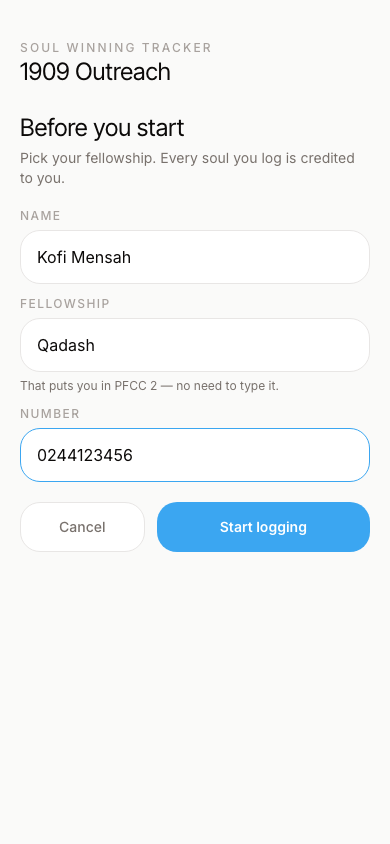
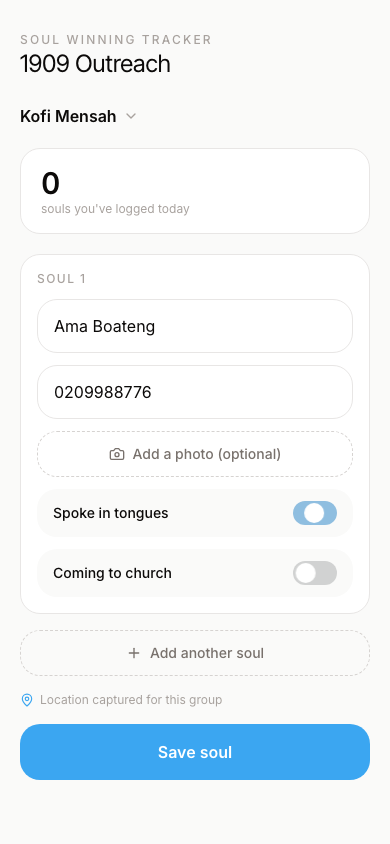
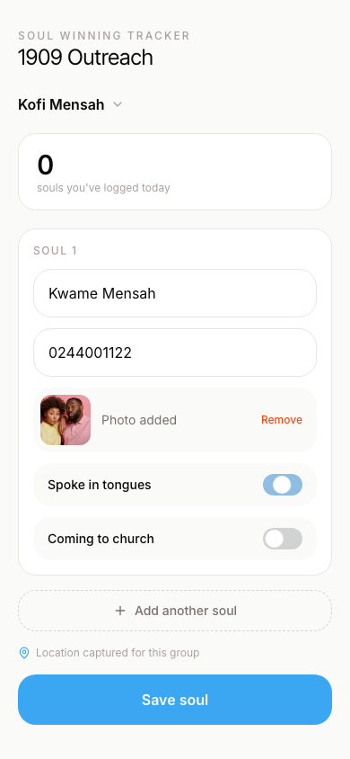
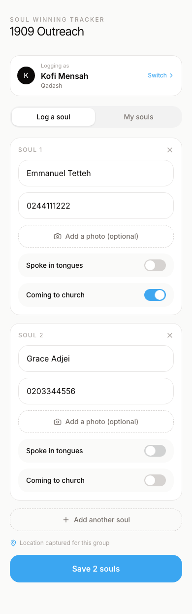
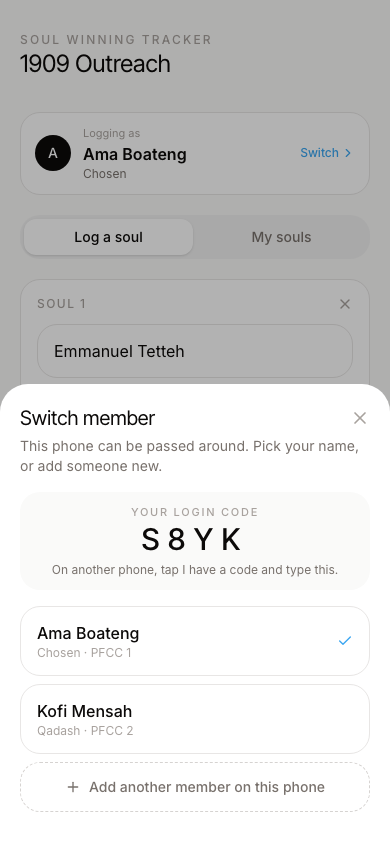
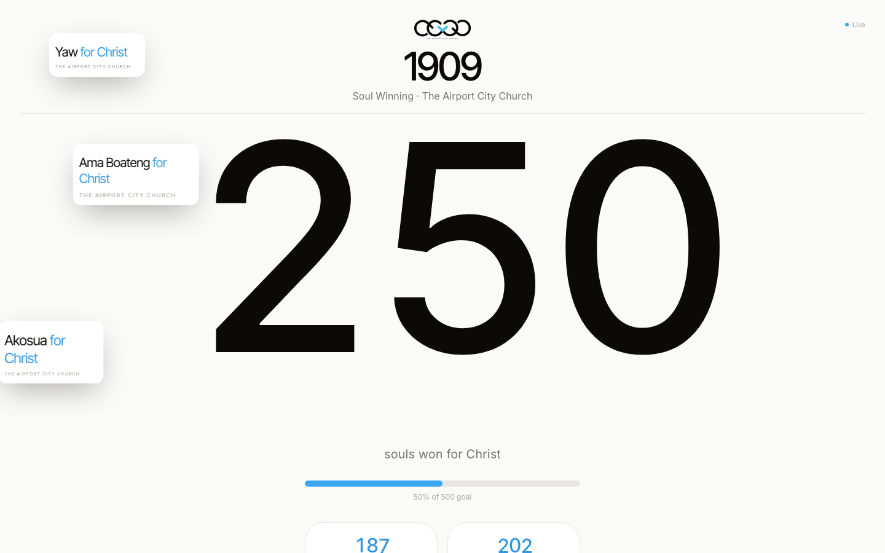
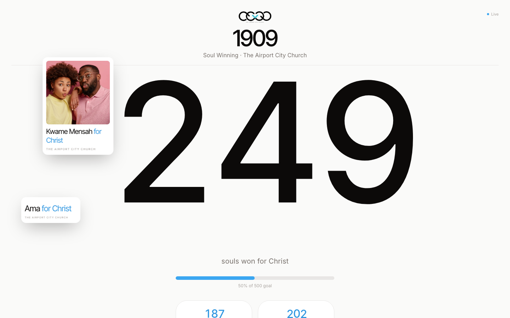
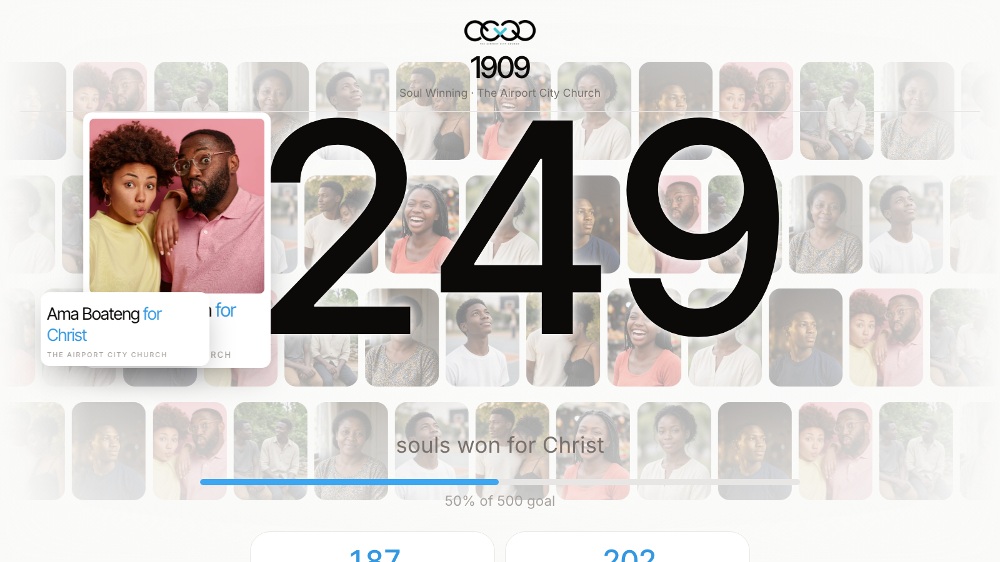
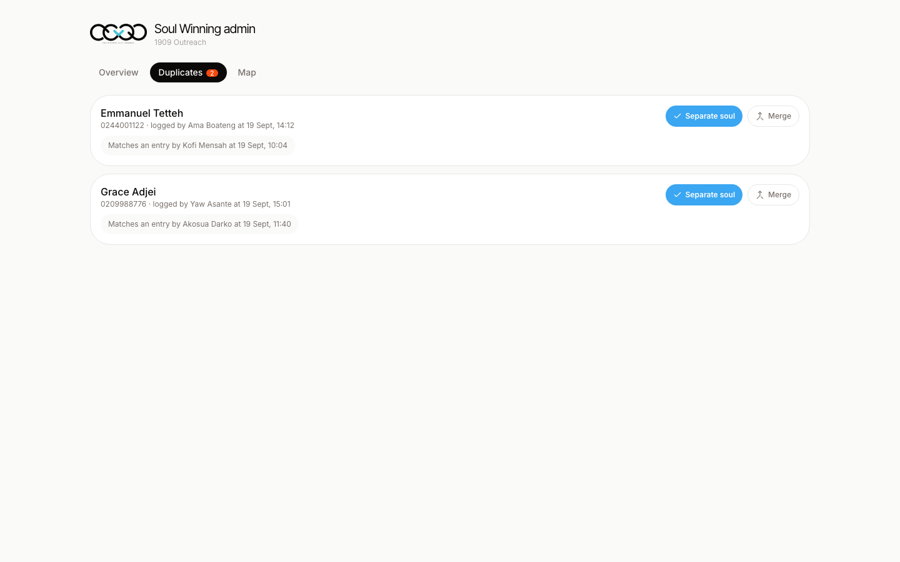
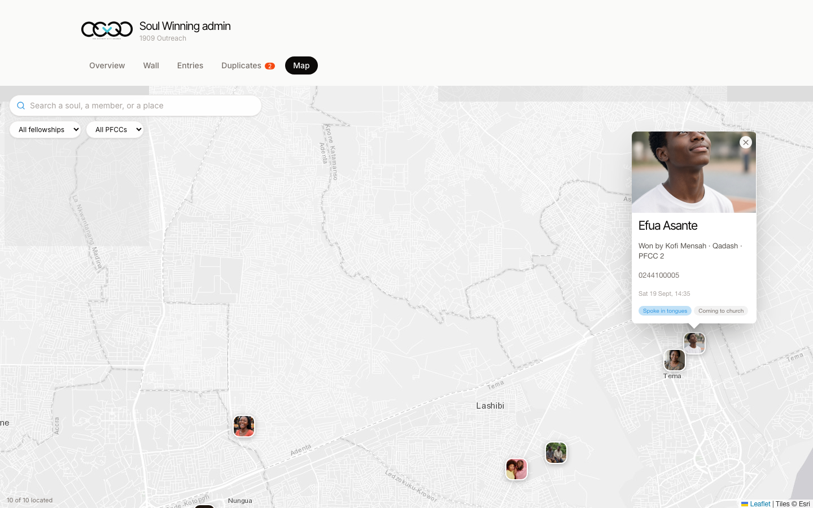

# Soul Winning — 1909

Members of The Airport City Church log every soul won during outreach. There is no volunteer role: the person entering on a phone is a **member**. The public counter celebrates each new soul, and admins review the day from a private dashboard.

Re-capture these pictures with:

```bash
npm run shots:soulwinning
```

---

## Field app (`/1909/entry`)

### Member onboarding



A member picks Start new or I have a code. Start new asks for name, fellowship and number — PFCC is filled in automatically. The login code lives under Switch, so it is not on the logging screen. On another phone they tap I have a code and type it.

### Location


Location is asked up front so every soul can be pinned to where it was won. The member taps Allow; the entry form does not open until that is settled.

### Logging a soul



Name, phone, tongues and church-attendance, with a location already captured. A photo is optional.



Same form after a photo is attached — the preview sits on the card before save.

### A group of souls



“Add another soul” keeps people won in the same sitting on one submission. They share the first soul’s location.

### Switching members



Several members can share one phone. Tap the name at the top, pick who is entering, or add a new member without retyping anyone already on the device.

---

## Live counter (`/1909`)

Cards only appear when a soul is entered. These shots wait until that name is on the move — they are not empty totals.



Ama Boateng was typed on the member’s phone, then released across the counter with other names. The odometer ticks as they appear.



Kwame Mensah was logged with a photo. The card carries the picture, the name, and “for Christ” while confetti is still in the air.

### Big screen (`/1909/screen`)



The same live feed, sized for a hall. No controls — it is meant to stay up.

---

## Admin (`/1909/admin`)

### Overview


Souls, tongues, church attendance, and how many members are entering. Rankings can be fellowships, PFCCs, or members.

### Duplicate review



A matching name and phone is saved, then held out of the public count until an admin marks it as a separate soul or merges it.

### Map



Pins show fellowship, PFCC, member and time — not the soul’s name or phone. Search looks up a soul, a member, or a place.
