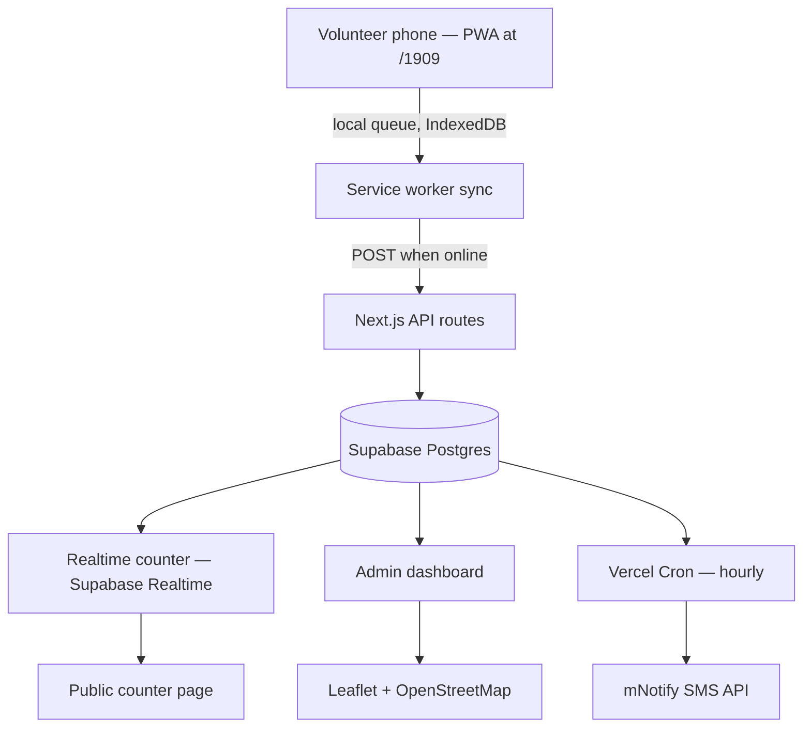
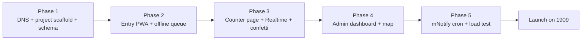

# Soul Winning Tracker — Technical Integration Plan

2026-09-17 · @Someone

## 1. Overview & Goals

A field-usable app for `soulwinning.theairportcitychurch.com/1909` that lets members log every soul won during a day-long outreach event — name, phone, precise device location, whether the person spoke in tongues, and whether they're coming to church — with a public, celebratory live counter, and an admin side with analytics, rankings and a map.

**Scale & conditions this design assumes:**

- Thousands of entries in a single day, from many members simultaneously.
- Entry happens outdoors, on phones, fast-paced, often on weak or no mobile signal.
- Volunteers already have the consent of the person they're entering — no in-app consent step needed.
- No login system for members — lightweight on-device identification only.

**Non-negotiables driving the design below:** it must never lose an entry to a dropped connection, it must never make a member wait on a spinner in the field, and the admin side must handle sustained high-volume writes without falling over.

## 2. System Architecture

Recommendation: build this as a **separate Next.js app inside the same monorepo/org** (or a standalone repo if you prefer full isolation), deployed as its **own Vercel project**, mapped to the `soulwinning` subdomain. Reasons: it needs a PWA service worker and offline caching strategy that the main church site (bookings, SOTW) doesn't and shouldn't inherit; it will take a very different traffic pattern (a single-day burst of writes) than the main site; and keeping it separate means a bug or spike here can never take down `theairportcitychurch.com` itself. It still uses the **same Supabase project** as `tacc_web` (new tables, isolated by RLS policies), the **same mNotify account/credentials**, and can be added to the same Vercel team so cron and env vars are managed in one place.

**Why Supabase Realtime for the counter:** since many members are entering souls at once and the counter page needs to feel alive (confetti, floating names), subscribing the counter page to Postgres changes via Supabase Realtime is simpler and cheaper than polling, and it's already in your stack.

**Why Vercel Cron for SMS:** you already use it; a scheduled function running hourly during the event window queries the day's totals and calls mNotify — no new infrastructure.

## 3. DNS & Deployment

1. Create the new Vercel project (e.g. `tacc-soulwinning`) from its own repo or a package inside a monorepo.
2. In Vercel → that project → Domains, add `soulwinning.theairportcitychurch.com`.
3. At your DNS provider for `theairportcitychurch.com`, add:
   - `CNAME soulwinning → cname.vercel-dns.com`
4. Route `/1909` as a page/route inside that project (`app/1909/page.tsx`), not a redirect — keeps it fast and lets it be the PWA's install scope.
5. Add the same environment variables the main site uses for Supabase (`NEXT_PUBLIC_SUPABASE_URL`, `NEXT_PUBLIC_SUPABASE_ANON_KEY`, `SUPABASE_SERVICE_ROLE_KEY`) and mNotify, scoped to this new project.
6. Register the hourly job in this project's `vercel.json` cron config, pointed at an API route that triggers the mNotify send.

## 4. Data Model (Supabase / Postgres)

Described as tables and fields here — actual SQL/migrations come at build time, not in this doc.

| Table | Key fields | Notes |
| --- | --- | --- |
| `sw_campaigns` | id, name, event\_date, active | One row per outreach event (e.g. "1909 — Sep 2026"); lets you reuse the same app for future events without mixing data |
| `sw_entrants` | id, device\_id, name, fellowship, phone, pfcc, created\_at | The member entering data. `device_id` is a locally-generated UUID stored in the browser — this is the "no login" identity |
| `sw_soul_entries` | id, campaign\_id, entrant\_id, group\_id, soul\_name, phone, latitude, longitude, spoke\_in\_tongues (bool), coming\_to\_church (bool), created\_at, synced\_at | One row per soul. `group_id` links souls entered together in one sitting (see §6) so they share a location |
| `sw_sms_config` | id, campaign\_id, phone\_number, enabled | The configurable number(s) that get the hourly SMS |
| `sw_sms_log` | id, sent\_at, message, campaign\_id | Audit trail of what was actually sent, useful for debugging mNotify issues mid-event |

**RLS:** `sw_soul_entries` and `sw_entrants` allow public **insert** (no auth needed — members aren't logged in) but restrict **select/update/delete** to the existing `admin_roles` table you already use elsewhere in `tacc_web`. The public counter page reads only aggregate counts via a Postgres function/view, never raw rows, so no personal data is exposed client-side on the big screen.

## 5. Field App: Onboarding & Switch-User

**First visit on a device:** a one-time short form — Name, Fellowship, Number, PFCC — saved to `localStorage` (not a login, just "remember this device's current entrant"). This entrant's `device_id` is generated once and reused for every entry from that device.

**Switching who's entering:** a small "Not you?" control (e.g. a tap on the member's name shown at the top of the screen) opens a pick-list of everyone who has entered on *that device* before, plus "+ New member." Picking a name swaps the active member instantly — no re-typing their details, matching your answer that switching shouldn't require re-entry. "+ New member" runs the same short form once, then adds them to that device's list.

This keeps the whole thing device-scoped rather than account-scoped: fast, no passwords, but still lets you attribute every soul to a specific person for the leaderboard in §9.

## 6. Counter Page Behavior

**Single entry flow:**

1. Volunteer taps "Add a soul," fills Name, Phone, "spoke in tongues" (toggle), "coming to church" (toggle).
2. Location is captured automatically from the device on first save of the group (see below) — no manual entry, per your answer.
3. On save: entry is queued locally, counter increments **optimistically** (instantly, before server confirmation — see §7), confetti fires, and the soul's name floats across the screen with "for Christ."
4. Running tallies for "spoke in tongues" and "coming to church" update at the bottom of the counter page.

**"Add another soul" (multi-soul entries):** at the bottom of the entry form, "+ Add another soul" appends a new soul block to the *same submission group* (`group_id`). Only Name, Phone, tongues, and church-attendance are asked for each additional soul; all souls in that group inherit the **first soul's location**, exactly as you specified. Volunteers can add as many as needed before submitting the group.

**Milestone congratulations:** after every 10th soul entered by a given entrant (checked against `sw_soul_entries` count per `entrant_id`), a small congratulatory banner/toast shows on the entry screen ("🎉 You've led 10 souls today!"). This is separate from the public counter's confetti — one is per-entry celebration for everyone to see, the other is a personal milestone for the member.

## 7. Offline-First & Reliability Strategy

This is the section that determines whether the app "crashes" (or, more realistically, silently loses entries) in the field. Recommended approach:

- **Build the entry form as a PWA** with a service worker (Workbox via `next-pwa` or a hand-rolled worker) so the app shell loads even with zero signal.
- **Write every entry to IndexedDB first**, immediately, regardless of connection. The UI reflects that write instantly (optimistic counter increment, confetti) — the member never waits on the network.
- **A background sync queue** pushes queued entries to Supabase whenever connectivity is available, retrying with backoff on failure. `synced_at` on `sw_soul_entries` stays null until confirmed; a small "X pending sync" indicator (not blocking) tells members if their device is behind.
- **Idempotent inserts:** generate the entry's UUID client-side (not server-side) so a retry after a flaky connection never creates a duplicate row.
- **Separate deployment (§2)** means this app's traffic and any bug in it can't take down bookings or the main site.
- **Load handling on the counter page:** since many devices write concurrently, the public counter should read from a lightweight aggregate (a Postgres materialized view or a `counts` table updated by trigger) rather than counting all rows live on every page load — keeps it fast even at thousands of entries.
- **Graceful degradation:** if geolocation permission is denied or GPS can't get a fix in time, don't block the submission — queue it with a null location and let the member continue; a background job can prompt for a retry later, or the entry simply won't appear on the map, which is far better than losing the soul-count itself.
- **Load-test before the event:** simulate a burst of a few hundred concurrent submissions the week before, on both the API route and the Supabase Realtime channel, so the actual event day isn't the first time it's tested at scale.

## 8. SMS Alerts (mNotify)

- A **Vercel Cron job**, scoped to the event day (e.g. hourly between 7am–10pm on the campaign's `event_date`), calls an API route.
- That route queries `sw_soul_entries` for: (a) total souls so far in the campaign, and (b) souls in the last hour — matching your "both" answer.
- It sends via mNotify's API, since it's already integrated in `tacc_web`, to the number(s) in `sw_sms_config` — kept **configurable from the admin panel** rather than hardcoded, so it can be changed on the day without a redeploy.
- Example message shape: *"1909 Update (2pm): 47 souls this hour, 312 total today."*
- Every send is logged to `sw_sms_log` so you can confirm delivery patterns after the event or debug a missed hour.

## 9. Admin Dashboard & Analytics

Gated behind the existing `admin_roles` system already used in `tacc_web`, so no new auth pattern is needed.

- **Filters:** by campaign/event, and by hour-of-day (since it's a single day event, hourly breakdown matters more than daily).
- **Rankings:** leaderboards for top fellowships, top PFCCs, and top individual entrants, each by soul count — with secondary stats (tongues %, church-attendance %) alongside the count.
- **Trend charts:** souls-per-hour over the day, cumulative total climbing, and a tongues/church-attendance rate over time.
- **Export:** CSV export of raw entries (admin-only, since it includes names/phone numbers) and of the aggregate rankings.
- **SMS config panel:** where the number(s) from §8 get set/changed.

Built on the same `sw_soul_entries` table, aggregated with Postgres views/RPC functions rather than pulling all rows into the browser — important once you're at thousands of rows.

## 10. Map

Built with **Leaflet + OpenStreetMap tiles** (via `react-leaflet`), per your preference — no API key or usage cap to manage, unlike Google Maps.

- Each pin = one soul's precise `latitude`/`longitude` from `sw_soul_entries`; clustering (`react-leaflet-cluster` or similar) is worth adding once you're past a few hundred points, since thousands of individual pins on one map will be unreadable and slow to render.
- Clicking a cluster/pin can show a lightweight popup: fellowship, entrant, time — not the soul's name/phone, to avoid casually exposing personal data on a shared admin screen.
- Admin-only, same gating as §9.

## 11. Decisions & Confirmed Scope

**Confirmed:**

1. **Repo:** built as part of the existing `tacc_web` monorepo, not a standalone repo.
2. **SMS message format:** editable per event from the admin panel, not fixed — the admin panel's SMS config (§8/§9) should include an editable message template, not just the phone number.
3. **Visual direction:** brand colors/fonts for the confetti + floating-name animation are coming separately (Abeiku's repo).
4. **Future events:** `sw_campaigns` is a long-term structure — this app is built for reuse across future outreach events, not single-use for "1909" alone.

**Additional features confirmed for build:**

- **Big-screen mode:** a separate, unauthenticated projector view of the counter — bigger fonts, no entry form — for display on a venue screen, distinct from the member's own phone view.
- **Duplicate-name safety net:** if a name + phone combo matches an entry already logged today, the new entry is still **accepted and saved** (never blocked, so a member is never turned away), but it's **flagged as a possible duplicate and excluded from today's official count** until an admin reviews and confirms/merges it from the dashboard. This keeps the public counter accurate without risking a lost entry.

## 12. Build Plan

1. **Setup:** subdomain, Vercel project, Supabase tables/RLS.
2. **Entry PWA:** onboarding, switch-user, the soul form, offline queue — the highest-risk piece, so build and test it first.
3. **Counter page:** live tallies, confetti, floating names, milestone toasts.
4. **Admin side:** rankings, trend charts, CSV export, map.
5. **SMS + hardening:** cron job, mNotify wiring, then a full load test simulating event-day traffic before going live.
